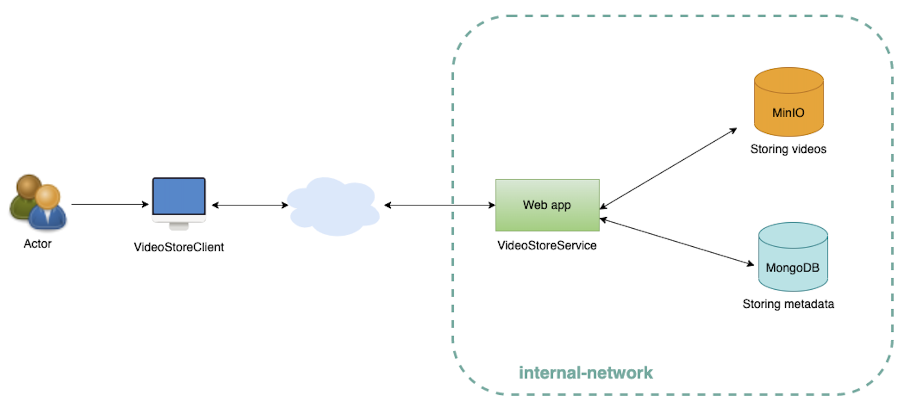

## About The Project

Video store client/service is a restful API self exercise based on the Spring Boot framework.

## Development Environment

Developing on macOS and also testing on Ubuntu:
| Name           | Version  | 
| :------------  |  ---:    | 
| macOS Monterey | 12.3.1   | 
| Ubuntu.        | 18.04    |    
    
Developing tools:
| Name           | Version  | 
| :------------  |  ---:    | 
| AdoptOpenJDK   | 11       | 
| SpringBoot     | 2.6.6    | 
| Apache Maven   | 3.6.0    | 
| Docker Desktop | 4.7.1    |
| Docker Engine  | 20.10.14 |
| Docker Compose | 2.4.1    |


## Installation

Use the install.sh shell script to build the project and run the dockers of backend service.

```bash
$ chmod +x install.sh
$ ./shell -b -r -d
```

If you want to know the meaning of each option in the above command line, you could use the -h option to know them.

```bash
$ ./shell -h
Usage:
 -h                               Display this help message.
 -b                               Build docker image after VideoStoreClient/VideoStoreService projects built.
 -r                               Run docker-compose to run all dockers of backend service.
 -d                               Run docker-compose in detach mode.
```

After building the projects, there are following items generated

| Name                      | Description                                | 
| :----------------------   | :---------------------------------------   | 
| basic-videostore-web-app  | Docker image for VideoStoreService web app | 
| /bin/VideoStoreClient.jar | VideoStoreClient client application        |  


## Usage

After building the projects, you could use following command lines to run dockers of backend service

```bash
$ cd docker-compose
$ docker-compose -f stack.yml up
```

If the backend service run up successfully, then you could go to bin file to use client app to communicate with backend service.  

Run following command will display the description of each subcommand
```bash
$ cd bin
$ java -jar VideoStoreClient.jar
Missing required subcommand
Usage: main [COMMAND]
Commands:
  upload    Upload video command
  delete    Delete video command
  download  Download video command
  list      List video command
  search    Search command
```

You could run following command to get the list of the videos
```bash
$ java -jar VideoStoreClient.jar list
file id: 626cf7b9dbb4da1321e9bbf0, file name: earth.mp4
```

If you want to download the video file, then you could use following command to download it. After downloading the video file successfully, it will show on your current directory.
```bash
$ java -jar VideoStoreClient.jar download 626cf7b9dbb4da1321e9bbf0
earth.mp4 file download successfully.

$ ls
VideoStoreClient.jar earth.mp4
```

You also could use delete command to delete the video from the backend service. After deleting the video file, then it will show there is no file when you get the list again.
```bash
$ java -jar VideoStoreClient.jar delete 626cf7b9dbb4da1321e9bbf0
Delete 626cf7b9dbb4da1321e9bbf0 successfully.

$ java -jar VideoStoreClient.jar list
There is no file.
```

Use following command to upload earth.mp4 video again, and show the list after uploading the video file.
```bash
$ java -jar VideoStoreClient.jar upload ./earth.mp4
Upload file successfully.
File id: 626e22ec83d4ac2c2094eeb3
File name: earth.mp4
File Url: http://localhost:8080/v1/files/626e22ec83d4ac2c2094eeb3

$ java -jar VideoStoreClient.jar list
file id: 626e22ec83d4ac2c2094eeb3, file name: earth.mp4
```

For search command, you could search file by name and duration range of video file
```bash
$ java -jar VideoStoreClient.jar search filename earth.mp4
file id: 626e42257d2a4f5c2b2d7d97, file name: earth.mp4

$ java -jar VideoStoreClient.jar search duration 15 40
file id: 626e4bd225b4290f5a0b88b4, file name: earth.mp4
```

Convert mp4 to webm command
```bash
$ java -jar VideoStoreClient.jar list
file id: 626e4bd225b4290f5a0b88b4, file name: earth.mp4

$ java -jar VideoStoreClient.jar convert 626e4bd225b4290f5a0b88b4 WEBM
File id: 626e5ea7b3888c557ff397b6
File name: earth.webm
File Url: http://localhost:8080/v1/files/626e5ea7b3888c557ff397b6
```

## Simple chart for this project

